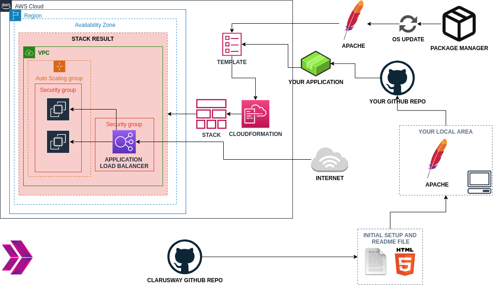
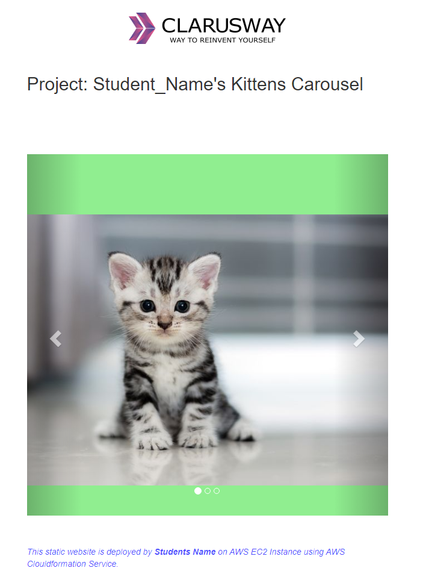

# Project-102 : Kittens Carousel Static Website deployed on AWS Application Load Balancer with Auto Scaling Group using AWS Cloudformation

## Description

Kittens Carousel is a static website application deployed with Apache Web Server on AWS Application Load Balancer with Auto Scaling Group of Elastic Compute Cloud (EC2) Instances using AWS Cloudformation Service.

## Problem Statement



- Your company has recently started a web application project that will serve as an attraction point for pet lovers. After your team have deployed the app on EC2 instance successfully, your company decided to deploy the Application with load balancer and auto scaling group to test it in cloud environment.

- As a first step, developers in your team have prepared a user interface design of kittens carousel application and pushed necessary files for the project to the repository on Github.

- Your task is to deploy the application behind the load balancer with auto scaling group in the development environment. As a result, you need to deploy the web application using the `index.html` and an images given within the `static-web` folder. Note the followings for your web application.

  - User should face first with `index.html` when web app started.

  - Application should be deployed on Apache Web Server.

- Application should be deployed in the development environment on AWS Application Load Balancer with Auto Scaling Group of Elastic Compute Cloud (EC2) Instances using Cloudformation Service. In the development environment, you can configure your Cloudformation template using the followings,

  - The application stack should be created with new AWS resources.

  - Template should create Application Load Balancer with Auto Scaling Group of Amazon Linux 2 EC2 Instances within default VPC.

  - Application Load Balancer should be placed within a security group which allows HTTP (80) connections from anywhere.

  - EC2 instances should be placed within a different security group which allows HTTP (80) connections only from the security group of Application Load Balancer.

  - The Auto Scaling Group should use a Launch Template in order to launch instances needed and should be configured to;

    - use all Availability Zones.

    - set desired capacity of instances to `2`

    - set minimum size of instances to `1`

    - set maximum size of instances to `3`

    - set health check grace period to `90 seconds`

    - set health check type to `ELB`

  - The Launch Template should be configured to;

    - prepare Apache Web Server environment on EC2 instance,

    - download the Kitten Carousel Application code from Github repository,

    - deploy the application on Apache Server.
  
  - EC2 Instances type can be configured as `t2.micro`.

  - Instance launched by Cloudformation should be tagged `Web Server of StackName`.

  - Kittens Carousel Application Website URL should be given as output by Cloudformation Service, after the stack created.

## Project Skeleton

```text
102-kittens-carousel-static-website-alb-asg (folder)
|
|----readme.md         # Given to the students (Definition of the project)
|----cfn-template.yml  # To be delivered by students (Cloudformation template)
|----static-web
        |----index.html  # Given to the students (HTML file)
        |----cat0.jpg    # Given to the students (image file)
        |----cat1.jpg    # Given to the students (image file)
        |----cat2.jpg    # Given to the students (image file)
```

## Expected Outcome



### At the end of the project, following topics are to be covered;

- Apache Web Server Installation on Linux

- Static Website Deployment

- Bash scripting

- AWS EC2 Launch Template Configuration

- AWS EC2 Application Load Balancer Configuration

- AWS EC2 ALB Target Group Configuration

- AWS EC2 ALB Listener Configuration

- AWS EC2 Auto Scaling Group Configuration

- AWS EC2 Security Groups Configuration

- AWS Cloudformation Service

- AWS Cloudformation Template Design

- Git & Github for Version Control System

### At the end of the project, students will be able to;

- install Apache Web Server on Amazon Linux 2.

- demonstrate bash scripting skills using `user data` section within launch template in Cloudformation to install and setup web application on EC2 Instance.

- demonstrate their configuration skills of AWS EC2 Launch Templates, Application Load Balancer, ALB Target Group, ALB Listener, Auto Scaling Group and Security Groups.

- configure Cloudformation template to use AWS Resources.

- show how to use AWS Cloudformation Service to launch stacks.

- apply git commands (push, pull, commit, add etc.) and Github as Version Control System.

## Steps to Solution
  
- Step 1: Download or clone project definition from `clarusway` repo on Github

- Step 2: Create project folder for local public repo on your pc

- Step 3: Prepare a cloudformation template to deploy your app on EC2 Instance

- Step 4: Push your application into your own public repo on Github

- Step 5: Deploy your application on AWS Cloud using Cloudformation template to showcase your app within your team.

## Notes

- Customize the application by hard-coding your name instead of `student_name` within `index.html`.

- Use AWS CLI commands to get subnet ids of the default VPCs.

## Resources

- [AWS Cloudformation User Guide](https://docs.aws.amazon.com/AWSCloudFormation/latest/UserGuide/Welcome.html)

- [AWS CLI Command Reference](https://docs.aws.amazon.com/cli/latest/index.html)
