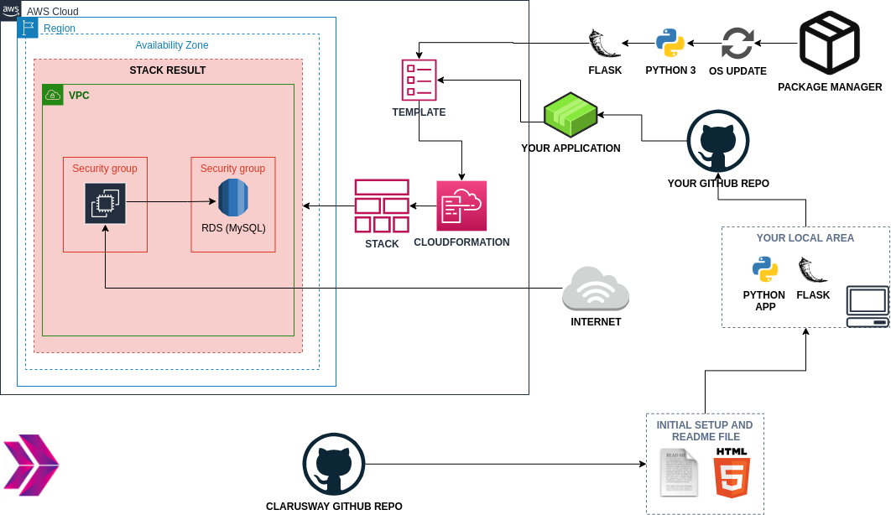

# Project-103 : To-Do Web API (Python Flask) deployed on AWS EC2 and RDS using Cloudformation

## Description

To-Do Web API Application aims to create a to-do web service to give students basic understanding of REST API.  The application is to be coded in Python and deployed as a RESTful web service with Flask on AWS Elastic Compute Cloud (EC2) Instance and Relational Database Service (RDS) Instance using AWS Cloudformation Service.

## Problem Statement



- Your company has recently started a project that aims to serve as workspace management application and your team will create a `To Do List` Application as Web Service as a part of this project.  

- As a first step, you need to write the `CRUD` functions that `c`reates, `r`eads, `u`pdates and `d`eletes a to-do task in the To-Do DB.

- Tasks should be kept in separate MySQL database in AWS RDS service, and a To-Do task in the DB should be defined with following fields:

  - task_id: unique identifier for tasks, type is numeric.

  - title: short task description, type is string.

  - description: long task description. type is string.

  - is_done: task completion state, type is boolean.

- As a second step, you need to transform your function into RESTful web service using Python Flask Framework. Below table shows how the HTTP methods are to be designed to affect the given resources identified by URIs.

| HTTP Method  | Action | Example|
| --- | --- | --- |
| `GET`     |   Obtain information about a resource | http://[hostname]/todos (retrieves list of all todos) |
| `GET`     |   Obtain information about a resource | http://[hostname]/todos/123 (retrieves todo with id=123) |
| `POST`    |   Create a new resource	            | http://[hostname]/todos (creates a new todo, from data provided with the request) |
| `PUT`     |	Update a resource               	| http://[hostname]/todos/123 (updates the todo with id=123, from data provided with the request) |
| `DELETE`  |	Delete a resource              	    | http://[hostname]/todos/123 (delete the todo with id=123) |

- Lastly, you are requested to push your program to the project repository on the Github and deploy your solution in the development environment on AWS EC2 Instance using AWS Cloudformation Service to showcase your project. In the development environment, you can configure your Cloudformation template using the followings,

  - The application stack should be created with new AWS resources.

  - The application should run on Amazon Linux 2 EC2 Instance

  - EC2 Instance type can be configured as `t2.micro`.

  - Instance launched by Cloudformation should be tagged `Web Server of StackName`

  - The Web Application should be accessible via web browser from anywhere.

  - The Application files should be downloaded from Github repo and deployed on EC2 Instance using user data script within cloudformation template.

  - For RDS Database Instance;
  
    - Instance type can be configured as `db.t2.micro`

    - Database engine can be `MySQL` with version of `8.0.19`

  - To-Do Web API URL should be given as output by Cloudformation Service, after the stack created.

## Project Skeleton

```text
003-to-do-web-api-ec2-rds (folder)
|
|----readme.md         # Given to the students (Definition of the project)
|----cfn-template.yml  # To be delivered by students (Cloudformation template)
|----app.py            # To be delivered by students (Python Flask Web Application)
```

## Expected Outcome

### At the end of the project, following topics are to be covered;

- Algorithm design

- Programming with Python

- Programming with SQL

- Web API programming with Python Flask Framework

- MySQL Database Configuration

- Bash scripting

- AWS EC2 Service

- AWS Security Group Configuration

- AWS Relational Database Service Configuration

- AWS Cloudformation Service

- AWS Cloudformation Template Design

- Git & Github for Version Control System

### At the end of the project, students will be able to;

- apply coding skills using iterables(dict), operators, if statements and functions within Python

- demonstrate their knowledge of installing Python and Flask framework on Amazon Linux 2 EC2 instance.

- apply knowledge of building a web application with Python Flask framework.

- improve web programming skills using HTTP GET/POST/PUT/DELETE methods

- understand the basics of REST API architecture.

- design and implement REST API with Python Flask framework.

- configure connection to the `MySQL` database.

- work with a database using the SQL within Flask application.

- improve bash scripting skills using `user data` section in Cloudformation to install and setup web application on EC2 Instance

- configure AWS EC2 Instance and Security Groups.

- configure AWS RDS Instance and RDS Security Groups.

- configure Cloudformation template to use AWS Resources.

- use AWS Cloudformation Service to launch stacks.

- use git commands (push, pull, commit, add etc.) and Github as Version Control System.

- run the web application on AWS EC2 instance using the GitHub repo as codebase.

## Steps to Solution
  
- Step 1: Download or clone project definition from `clarusway-aws-workshop` repo on Github

- Step 2: Create project folder for local public repo on your pc

- Step 3: Write the To-Do API CRUD functions in Python

- Step 4: Transform your CRUD functions into a RESTful web service using Python Flask framework

- Step 5: Prepare a cloudformation template to deploy your app on EC2 Instance

- Step 6: Push your application into your own public repo on Github

- Step 7: Deploy your application on AWS Cloud using Cloudformation template to showcase your app within your team.

## Notes

- To showcase your projects REST functions, use `curl` command for each HTTP methods namely, `GET`, `POST`, `PUT`, `DELETE`.

## Resources

- [Python Flask Framework](https://flask.palletsprojects.com/en/1.1.x/quickstart/)

- [Python Flask Example](https://realpython.com/flask-by-example-part-1-project-setup/)

- [REpresentational State Transfer](https://en.wikipedia.org/wiki/Representational_state_transfer)

- [AWS Cloudformation User Guide](https://docs.aws.amazon.com/AWSCloudFormation/latest/UserGuide/Welcome.html)
